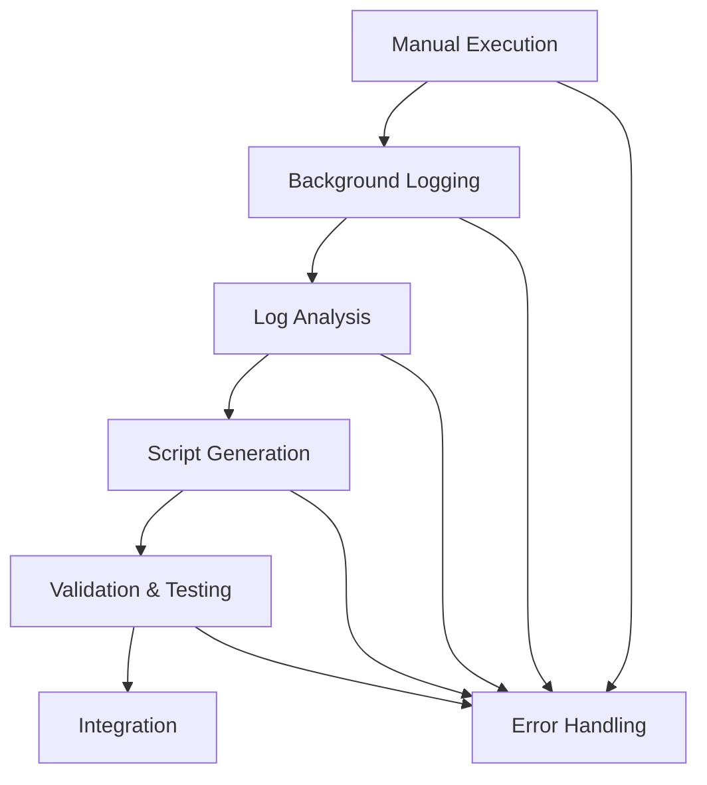

# Manual Command Logging to Pexpect Automation Workflow Plan

## Overview

This plan outlines a workflow for converting manually executed command sequences into automated pexpect scripts. The process leverages the existing pexpect infrastructure in the project, using `script -f` for background logging during manual execution, followed by Copilot-assisted analysis to generate automation scripts.

## Workflow Architecture



## Phase 1: Manual Command Execution with Logging

### 1.1 Session Setup
- **Command**: `script -f session_log.txt`
- **Purpose**: Start background logging of all terminal interactions
- **Options**:
  - `-f`: Flush output after each write for real-time logging
  - `-q`: Quiet mode (suppress script start/end messages)
  - Custom log filename with timestamp: `session_$(date +%Y%m%d_%H%M%S).log`

### 1.2 Manual Execution Guidelines
- **Environment Preparation**:
  - Ensure consistent starting state (same directory, environment variables)
  - Document initial conditions (current directory, active processes, environment vars)
  - Note any interactive prompts or authentication requirements

- **Execution Best Practices**:
  - Use clear, deliberate commands with proper timing
  - Include verification steps (e.g., `pwd`, `whoami`, status checks)
  - Handle expected prompts systematically
  - Document any conditional logic or decision points

### 1.3 Session Termination
- **Exit Command**: `exit` or `Ctrl+D`
- **Log Preservation**: Ensure log file is properly closed and contains complete session

## Phase 2: Log Analysis and Command Extraction

### 2.1 Log Format Understanding
- **Script Command Output**: Captures all stdin/stdout/stderr
- **Timestamps**: Not included by default (may need `script -t` for timing)
- **ANSI Sequences**: May contain terminal control codes requiring stripping

### 2.2 Command Sequence Extraction
- **Pattern Recognition**:
  - Identify command prompts (e.g., `$ `, `# `, `> `)
  - Extract commands between prompts
  - Capture command output and error messages
  - Detect interactive prompts and responses

- **Sequence Structuring**:
  - Group related commands into logical sequences
  - Identify dependencies and prerequisites
  - Note conditional branches and error handling paths

### 2.3 Edge Case Handling
- **Multi-line Commands**: Handle commands spanning multiple lines
- **Background Processes**: Detect `&` usage and process management
- **Pipes and Redirection**: Parse complex command chains
- **Interactive Applications**: Handle programs requiring user input
- **Timeout Scenarios**: Identify commands that may hang or require specific timing

## Phase 3: Pexpect Script Generation

### 3.1 Script Template Structure
```python
#!/usr/bin/env python3

import pexpect
import sys
import time
from pathlib import Path

# Import existing project utilities
from pexpect_handler import PexpectHandler
from logging_utils import InteractionLogger, SafeLoggedSpawn
from spawn_manager import SpawnManager

def create_automation_script(command_sequence, log_file="automation.log"):
    """
    Generate pexpect script from analyzed command sequence.

    Args:
        command_sequence: List of (command, expected_output, timeout) tuples
        log_file: Path to log file for execution tracking
    """

    # Initialize with existing infrastructure
    spawn_factory = lambda: pexpect.spawn(command_sequence[0]['shell'],
                                        encoding='utf-8',
                                        timeout=30)

    spawn_mgr = SpawnManager(spawn_factory, log_file)
    child = spawn_mgr.get()

    try:
        for step in command_sequence:
            # Send command
            child.sendline(step['command'])

            # Wait for expected output
            if step.get('expect_patterns'):
                index = child.expect(step['expect_patterns'],
                                   timeout=step.get('timeout', 30))
                expected = step['expect_patterns'][index]
                print(f"Matched: {expected}")

            # Optional: Verify output or handle errors
            if step.get('verification'):
                # Add verification logic
                pass

    except pexpect.TIMEOUT:
        print(f"Timeout waiting for expected output in step: {step['command']}")
        # Error handling
    except Exception as e:
        print(f"Error during automation: {e}")
        # Cleanup and error recovery
    finally:
        child.close()

if __name__ == "__main__":
    # Load command sequence from analysis
    command_sequence = [
        # Generated from log analysis
    ]

    create_automation_script(command_sequence)
```

### 3.2 Integration with Existing Tools

- **PexpectHandler Integration**:
  - Use existing `PexpectHandler` class for consistent error handling
  - Leverage built-in logging and timeout management
  - Integrate with project's logging standards

- **SpawnManager Utilization**:
  - Create spawn factories for different shell types
  - Use existing log file management
  - Maintain compatibility with current session handling

- **Logging Integration**:
  - Use `InteractionLogger` for consistent timestamped logging
  - Strip ANSI codes using existing utilities
  - Maintain log format compatibility

### 3.3 Error Handling and Robustness

- **Timeout Management**:
  - Configurable timeouts per command
  - Graceful timeout handling with retry logic
  - Timeout escalation for problematic commands

- **Error Recovery**:
  - Checkpoint-based execution (resume from last successful step)
  - Cleanup procedures for failed sessions
  - Error state logging and reporting

- **Validation Checks**:
  - Pre-execution environment validation
  - Post-command state verification
  - Output pattern matching with fuzzy logic

## Phase 4: Validation and Testing

### 4.1 Script Validation
- **Syntax Checking**: Ensure generated Python code is valid
- **Import Verification**: Confirm all required modules are available
- **Logic Review**: Validate command sequence makes sense

### 4.2 Dry Run Testing
- **Safe Execution Mode**: Run script with logging but no actual commands
- **Output Comparison**: Compare expected vs actual output patterns
- **Timing Analysis**: Identify commands requiring special timing

### 4.3 Integration Testing
- **Environment Matching**: Test in same environment as manual execution
- **Dependency Checking**: Ensure all required tools/programs are available
- **Permission Validation**: Verify script has necessary permissions

## Phase 5: Workflow Integration and Documentation

### 5.1 Tool Integration
- **Copilot Integration**: Use Copilot for log analysis and script generation
- **IDE Integration**: Leverage VS Code's terminal and file management
- **Version Control**: Track generated scripts and their source logs

### 5.2 Documentation Requirements
- **User Guide**: Step-by-step instructions for the workflow
- **Troubleshooting Guide**: Common issues and solutions
- **Best Practices**: Guidelines for effective manual execution
- **API Documentation**: For any new utility functions

### 5.3 Maintenance and Updates
- **Log Format Evolution**: Handle changes in script command output
- **Pexpect Updates**: Adapt to new pexpect versions or features
- **Project Standards**: Maintain consistency with existing codebase

## Edge Cases and Error Handling

### 6.1 Log Analysis Challenges
- **Corrupted Logs**: Handle incomplete or corrupted log files
- **Non-ASCII Characters**: Properly handle special characters and encodings
- **Concurrent Sessions**: Manage logs from multiple simultaneous sessions
- **Large Log Files**: Efficient processing of extensive session logs

### 6.2 Command Complexity
- **Interactive Applications**: Handle programs like editors, pagers, or menus
- **Network Dependencies**: Manage commands requiring network connectivity
- **Resource Constraints**: Handle memory, disk, or CPU intensive operations
- **Race Conditions**: Address timing-dependent command sequences

### 6.3 Environment Variations
- **Shell Differences**: Support bash, zsh, fish, and other shells
- **System Variations**: Handle Linux, macOS, WSL differences
- **User Permissions**: Manage sudo, su, and privilege escalation
- **Path Dependencies**: Handle absolute vs relative paths

## Implementation Roadmap

### Phase 1: Core Infrastructure (Week 1-2)
- [ ] Create log analysis utility functions
- [ ] Implement basic command sequence extraction
- [ ] Develop script generation templates

### Phase 2: Integration (Week 3)
- [ ] Integrate with existing PexpectHandler and SpawnManager
- [ ] Add comprehensive error handling
- [ ] Implement validation and testing framework

### Phase 3: Documentation and Testing (Week 4)
- [ ] Create user documentation and guides
- [ ] Develop example workflows
- [ ] Test with various command scenarios

### Phase 4: Production Deployment (Week 5)
- [ ] Deploy workflow tools to project
- [ ] Train team on usage
- [ ] Establish maintenance procedures

## Success Metrics

- **Automation Success Rate**: >90% of manual sequences successfully automated
- **Error Reduction**: <5% runtime errors in generated scripts
- **Time Savings**: >70% reduction in repetitive task execution time
- **User Adoption**: >80% of team using workflow for new automation tasks

## Risk Mitigation

- **Fallback Procedures**: Manual execution still possible if automation fails
- **Version Control**: All generated scripts tracked and versioned
- **Testing Requirements**: No script deployed without validation
- **Documentation Updates**: Keep guides current with tool evolution

---

**Document Version**: 1.0
**Last Updated**: 2026-02-24
**Author**: Copilot Architect Agent</content>
<path>plans/manual_to_pexpect_automation_workflow.md